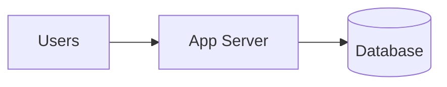
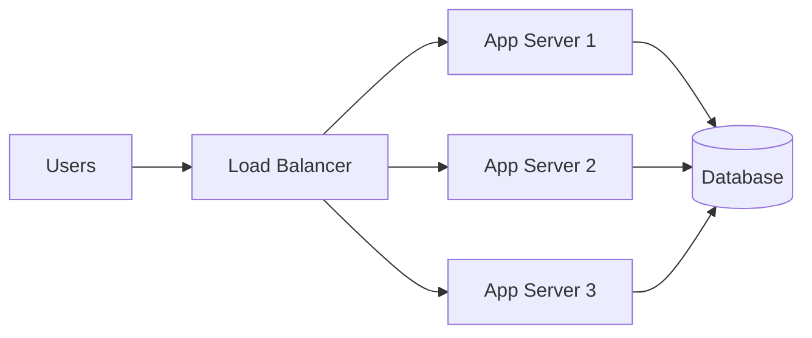
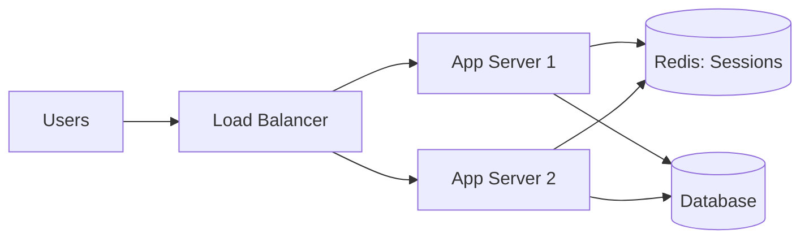
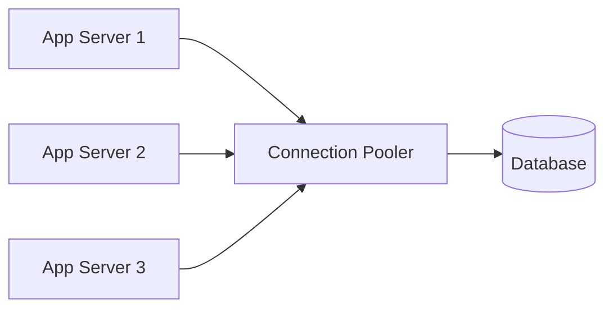
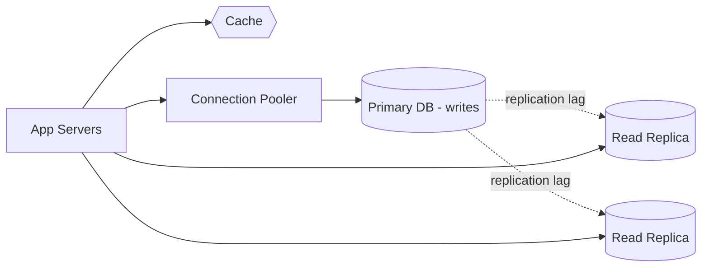
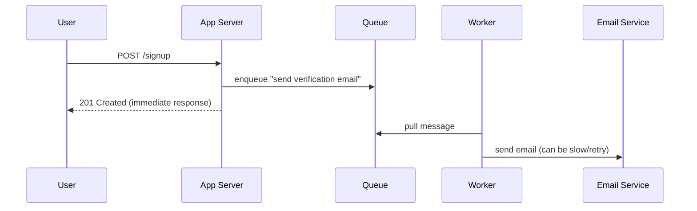
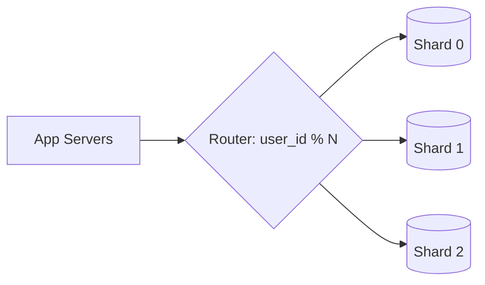
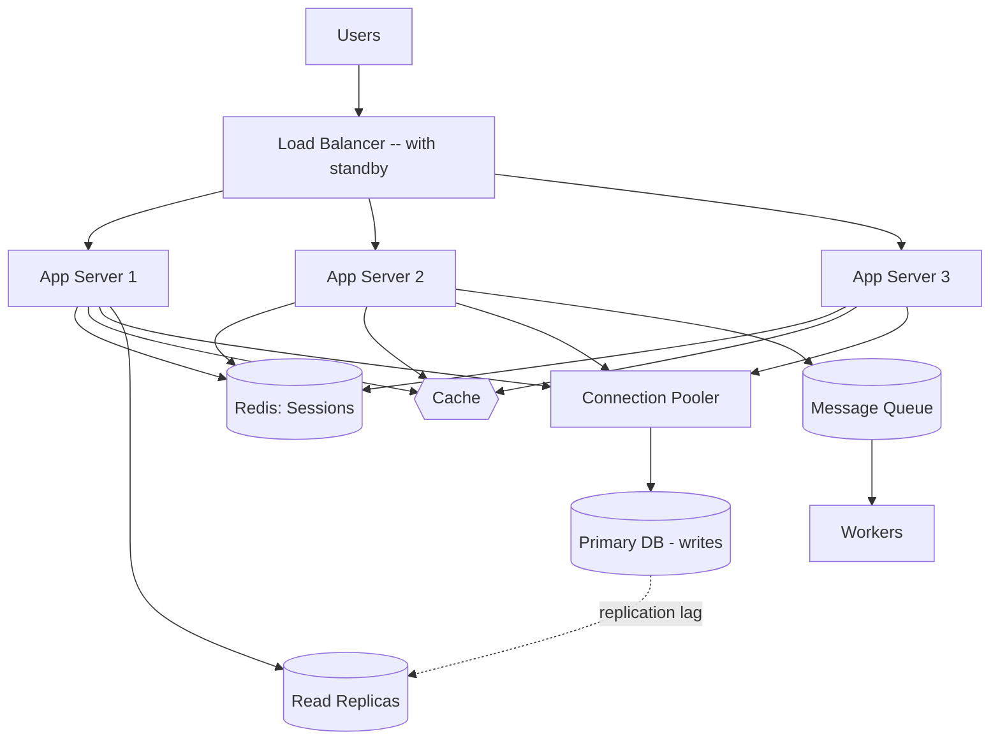

# Interview Prep: A Mental Model for Any System Design Problem

## Why this page is different from "System Design"

[System Design](06-system-design.md) gives you the interview *framework*
— the 30-45 minute structure (clarify requirements, sketch, deep-dive,
discuss trade-offs, summarize). This page is a complementary **mental
model**: a single story of *why* each piece of a distributed system
gets introduced, told in the order problems actually appear as load
grows. Where that page tells you *how to run the interview*, this page
gives you the *narrative* to reason from when you're stuck deciding what
to add next. The two are meant to be used together.

## The starting point: one server, one database

A surprising amount of real-world load — thousands, even tens of
thousands of users — is handled fine by **one application server and
one database**. This is the correct starting architecture for most
systems, and interviewers give real credit for saying so explicitly
instead of jumping straight to a distributed design.

The rest of this page is the story of what breaks, in order, as load
grows past what this simple setup can handle — and the minimal
technique introduced each time to fix *that specific* problem.

## Step 1: the server can't keep up → add more servers

The first symptom of running out of capacity is the app server hanging
or timing out under load. The fix is horizontal scaling: run multiple
copies of the same application behind a **load balancer**.

This immediately creates two new problems, not one:

### Problem 1a: the load balancer itself is a single point of failure

Every request now depends on the load balancer being up. Treat it the
same way you'd treat any other critical single instance: run a standby
(active-passive) or a redundant pair (active-active) behind a mechanism
like DNS failover or a virtual IP, so the load balancer isn't a new
single point of failure introduced to fix the old one. See
[Load Balancing and Caching at Scale](../system-design/02-load-balancing-and-caching-at-scale.md)
for health checks and routing algorithms.

### Problem 1b: a user's second request may land on a different server

If a user logs in and their session is only known to the server they
happened to hit, the next request — routed to a *different* server by
the load balancer — has no idea who they are. This is the problem that
**statelessness** and **centralized session storage** solve: don't keep
per-user state in any one server's memory; put it somewhere every
server can read identically, typically Redis (or a signed JWT the
client carries itself).

Full mechanics: [Scalability, Statelessness, and Scaling Strategies](../system-design/01-scalability-statelessness-and-scaling-strategies.md).

## Step 2: the database can't keep up either

Once request handling is spread across many stateless servers, the
database becomes the next bottleneck — but not always for the reason
people expect first (raw query load). Two distinct database problems
show up, usually in this order.

### Problem 2a: too many connections, not too many queries

Every database can only sustain a limited number of open connections
at once (often in the hundreds). If each of your app instances opens
its own pool of, say, 20 connections, and you scale from 3 instances to
30, the database suddenly needs to support 600 concurrent connections —
even if the actual query *volume* hasn't grown nearly that much. The
fix is a **centralized connection pooler** (e.g. PgBouncer) sitting
between the app instances and the database: the database only ever
sees a small, constant number of connections, and app instances borrow
and release a connection from the pooler as needed.

### Problem 2b: the database is still slow under real load

If connection pooling isn't the issue, the next levers, roughly in
order of how disruptive they are to introduce:

1. **Indexing** — the cheapest fix, and the first thing to check before
   reaching for anything more structural.
2. **Read replicas** — since reads vastly outnumber writes in most
   systems, copy the data to one or more read-only replicas and route
   reads there, keeping writes on the primary. The cost is
   **replication lag**: replicas trail the primary by some delay, so
   you must decide, per feature, whether staleness is acceptable — an
   account balance generally cannot tolerate lag and should read from
   the primary, while a follower count tolerating a 30-second lag is
   usually fine reading from a replica.
3. **Caching** — when the same expensive computation or query result is
   requested repeatedly, compute it once and serve subsequent requests
   from cache (typically Redis) instead of recomputing or re-querying.

Full mechanics: [Databases and Queues at Scale](../system-design/03-databases-and-queues-at-scale.md)
and [Load Balancing and Caching at Scale](../system-design/02-load-balancing-and-caching-at-scale.md).

## Step 3: slow background work blocks the user's request

A different kind of problem: the user's request itself is fast, but it
triggers *background* work that isn't — for example, a signup request
that needs to send a verification email. If the app waits on the email
service synchronously, a slow or flaky email provider makes every
signup slow or fail, even though signup itself had nothing to do with
email delivery.

The fix is **queues and workers**: the app publishes a message ("send
verification email to user X") to a queue and immediately responds to
the user, without waiting. A separate worker process pulls messages off
the queue and does the actual (slow, unreliable) work independently.

This decouples the *rate* at which requests come in from the *rate* at
which background work can be processed, at the cost of that work now
being asynchronous (eventually consistent) rather than guaranteed
complete by the time the user's request returns. Full mechanics:
[Databases and Queues at Scale](../system-design/03-databases-and-queues-at-scale.md).

## Step 4: the database is too big for one machine — sharding (last resort)

If indexing, read replicas, and caching are all in place and a single
primary database *still* can't handle the data volume or write
throughput, the last lever is **sharding**: splitting the data itself
across multiple independent databases, each holding a subset of the
data (e.g. `user_id % num_shards` decides which shard owns a given
user's rows).

Sharding is deliberately the *last* resort in this walkthrough, not the
first, because of what it costs: a query that used to be a single
`SELECT` against one database (e.g. "total number of users" or "total
balance across all accounts") now has to fan out to every shard and
aggregate the results in the application layer. Be explicit about
*which* field you shard on, since it determines which queries stay
cheap (single-shard) and which become expensive (cross-shard
fan-out). Full mechanics:
[Databases and Queues at Scale](../system-design/03-databases-and-queues-at-scale.md).

## The whole picture, assembled in order

## When to use this walkthrough

- As a mental checklist while sketching a design under interview
  pressure: "what's the *next* thing that breaks?" is often an easier
  question than "what's the complete correct architecture?"
- As a way to justify *why* you're introducing each component, in the
  order you introduce it — interviewers reward incremental,
  problem-driven reasoning over reciting a memorized "standard stack."

## When NOT to over-apply it

- Don't introduce every technique in this list regardless of the
  problem's actual scale — most of the value in a design answer comes
  from showing *when* each piece becomes necessary, not from listing
  all of them upfront. See the back-of-envelope estimation habit in
  [System Design](06-system-design.md).
- Don't reach for sharding, multi-region replicas, or a message queue
  before ruling out indexing, caching, and simpler fixes — in this
  walkthrough (and in most real systems), those cheaper levers resolve
  the majority of scaling problems.

## Common mistakes

- Treating the load balancer as inherently reliable and forgetting it
  needs its own redundancy.
- Adding more servers without addressing statelessness first, then
  being surprised users get logged out or lose cart contents randomly.
- Assuming more app servers means the database automatically needs
  sharding, when the actual first symptom is usually connection
  exhaustion, solved far more cheaply with a connection pooler.
- Adding read replicas without deciding, per feature, what level of
  replication lag is acceptable — and accidentally serving a stale
  balance or inventory count from a replica.
- Reaching for a queue for work that genuinely needs to complete before
  responding to the user (e.g. authorizing a payment), rather than for
  work that can safely happen after the response.
- Sharding on a key that makes the system's most common aggregate
  queries (counts, sums across all users) expensive fan-out operations.

## Interview questions

1. Why is "one server, one database" often the *correct* answer to
   start a design, rather than something to apologize for?

   **Answer:** Because a huge share of real systems never exceed what a
   single well-provisioned server and database can handle. Starting
   simple and justifying each addition with an actual bottleneck is a
   stronger signal than defaulting to maximum complexity.

2. You've added multiple app servers behind a load balancer. What two
   new problems does this introduce, and how do you solve each?

   **Answer:** The load balancer becomes a new single point of failure,
   solved with a standby/redundant pair. And a user's session may not
   be visible to whichever server handles their next request, solved by
   making servers stateless and storing session state centrally (e.g.
   Redis).

3. Your app is scaled to 30 instances and the database is refusing new
   connections, even though query volume hasn't grown that much. What's
   the likely cause and fix?

   **Answer:** Each instance is likely opening its own connection pool,
   and the sum across all instances exceeds what the database can
   sustain. A centralized connection pooler (e.g. PgBouncer) fixes this
   by presenting the database with a small, constant number of
   connections that app instances borrow and release.

4. When would you introduce read replicas, and what's the catch?

   **Answer:** When reads vastly outnumber writes and the primary can't
   keep up with read load. The catch is replication lag — replicas
   trail the primary, so you must decide per-feature whether that
   staleness is acceptable (a balance shouldn't read from a lagging
   replica; a follower count usually can).

5. Why would you use a message queue for sending a verification email
   instead of sending it directly in the request handler?

   **Answer:** So a slow or unreliable email provider doesn't block or
   fail the user's signup request. The app enqueues the work and
   responds immediately; a separate worker processes the queue
   independently, decoupling the user-facing request's latency from the
   background work's latency.

6. Why is sharding usually the last technique you reach for, not the
   first?

   **Answer:** Because it's the most operationally disruptive: it turns
   simple aggregate queries (totals, counts) into cross-shard fan-outs
   that must be merged in the application, and it requires a
   partitioning scheme (e.g. `user_id % N`) that's hard to change later.
   Indexing, read replicas, and caching solve most scaling problems at
   far lower cost first.

## Senior-level considerations

- The order these techniques appear in this walkthrough mirrors the
  order they should actually be *introduced* in a real system: reaching
  for sharding or a message queue before establishing whether indexing
  or a connection pooler already solves the problem is a sign of
  over-engineering, which senior engineers are expected to push back on.
- Each addition (load balancer, session store, connection pooler, read
  replicas, cache, queue, shards) trades simplicity for a specific
  capability — being able to say *which* problem each one solves, and
  what it costs operationally (replication lag, eventual consistency,
  cross-shard queries), is what separates a memorized list from real
  understanding.
- In practice, different parts of a system hit these bottlenecks at
  different times — a read-heavy catalog service may need caching and
  read replicas long before it needs a queue, while a notifications
  service may need queues from day one. Apply this walkthrough
  per-component, not as one linear path for the whole system.

## Related material

- [System Design](06-system-design.md) — the interview-time framework
  for structuring your answer (this page is the narrative to reason
  from *within* that structure).
- [System Design section overview](../system-design/index.md) — full
  mechanics behind every technique introduced above.
