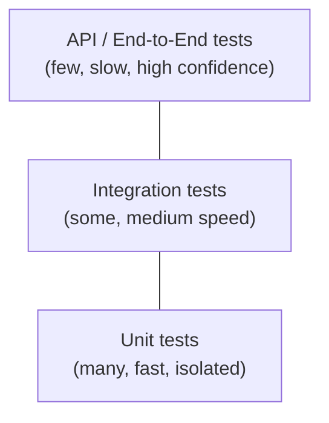

# Test Strategy and Isolation

## What

**Test strategy** is the deliberate mix of test types (unit,
integration, API/end-to-end) a project relies on, and **test isolation**
is ensuring each test's outcome depends only on its own setup — not on
shared state, execution order, or other tests.

## Why

Not every part of a system should be tested the same way: a pure function
deserves a fast unit test, but the wiring between your API layer, ORM,
and database needs an integration test to catch problems mocks would
hide. Poor isolation causes intermittently failing ("flaky") tests that
erode trust in the whole suite — engineers start ignoring red CI runs,
which is far more dangerous than not having tests at all.

## How

### The testing pyramid



Most tests should be fast unit tests; fewer, slower integration tests
verify components work together; a small number of end-to-end/API tests
verify the whole system as a user would experience it. Inverting this
(mostly slow end-to-end tests, few unit tests) produces a slow, flaky
suite that's expensive to maintain.

### Unit tests: isolate the thing under test

```python
def calculate_discount(price: float, is_premium_member: bool) -> float:
    return price * 0.8 if is_premium_member else price

def test_premium_discount():
    assert calculate_discount(100, is_premium_member=True) == 80
```

No mocking needed here — a pure function with no external dependencies
is the simplest, fastest kind of test.

```python
def test_creates_user_sends_welcome_email(monkeypatch):
    mock_send = Mock()
    monkeypatch.setattr("myapp.notifications.email_service.send", mock_send)
    create_user(db_session, name="Sayan", email="s@example.com")
    mock_send.assert_called_once()
```

Here the dependency (email service) is mocked — see
[Mocking and Monkeypatch](02-mocking-and-monkeypatch.md) — so the test
verifies `create_user`'s own logic without actually sending an email.

### Integration tests: real components, isolated environment

```python
@pytest.fixture
def db_session():
    engine = create_engine("postgresql://localhost/test_db")
    Base.metadata.create_all(engine)
    with Session(engine) as session:
        yield session
    Base.metadata.drop_all(engine)  # clean slate for the next test

def test_create_user_persists_to_db(db_session):
    user = create_user(db_session, name="Sayan", email="s@example.com")
    fetched = db_session.get(User, user.id)
    assert fetched.email == "s@example.com"
```

This test uses a *real* database (a dedicated test database, not
production) rather than mocking the ORM — it verifies the actual
SQL/ORM mapping works, which a unit test with a mocked session cannot
catch (e.g. a typo'd column name, a broken foreign key constraint).

### API tests: exercise the whole stack

```python
def test_create_user_endpoint(client, db_session):
    response = client.post("/users", json={"name": "Sayan", "email": "s@example.com"})
    assert response.status_code == 201
    assert db_session.get(User, response.json()["id"]) is not None
```

See [OpenAPI and Testing](../fastapi/07-openapi-and-testing.md) for the
FastAPI-specific mechanics (`TestClient`, dependency overrides) that make
these tests fast despite exercising the full request/response cycle.

### Isolation: transaction rollback per test

```python
@pytest.fixture
def db_session(db_engine):
    connection = db_engine.connect()
    transaction = connection.begin()
    session = Session(bind=connection)
    yield session
    session.close()
    transaction.rollback()  # undo everything the test did
    connection.close()
```

Wrapping each test in a transaction that's always rolled back (never
committed) gives full isolation — every test starts from the same clean
state — while avoiding the overhead of recreating the whole schema per
test.

### Isolation: independent test data

```python
# BAD: tests depend on shared, mutable fixture data
def test_updates_user(shared_user):
    shared_user.name = "Changed"
    ...  # a later test relying on shared_user.name == "Original" now fails

# GOOD: each test creates its own data
def test_updates_user(db_session):
    user = create_user(db_session, name="Original")
    update_user(db_session, user.id, name="Changed")
    assert db_session.get(User, user.id).name == "Changed"
```

Each test creating its own data (rather than reusing a shared fixture
instance across tests) prevents one test's side effects from leaking
into another — a common source of order-dependent flaky tests.

### Test doubles at the boundary, not the core

```python
# Mock the payment gateway (external boundary) ...
def test_checkout_calls_payment_gateway(monkeypatch):
    mock_charge = Mock(return_value={"status": "success"})
    monkeypatch.setattr("myapp.payments.gateway.charge", mock_charge)
    result = checkout(cart, payment_method="card")
    assert result.status == "completed"

# ... but let the actual order/inventory logic run for real
```

Mock at genuine system boundaries (third-party APIs, payment gateways,
email providers) but let your own business logic run unmocked wherever
practical — this is what keeps integration tests meaningful.

## When to use

- Unit tests for pure logic and anything easily isolated with mocks —
  the majority of your test suite.
- Integration tests for the ORM/database layer, and any code where the
  *actual* interaction with a real dependency is the risk (a query that
  works against a mock session but fails against the real database).
- A small number of API/end-to-end tests covering critical user flows
  end-to-end, as a final safety net.
- Transaction-rollback fixtures for database test isolation — fast and
  fully isolated without schema recreation overhead.

## When NOT to use

- Don't write end-to-end tests for every edge case a unit test could
  cover far faster — reserve the slow, expensive tests for what only they
  can verify.
- Don't share mutable fixture instances across tests when isolation
  matters more than setup speed.
- Don't skip integration tests entirely in favor of only unit tests with
  mocked databases — the ORM/database boundary is exactly where
  mock-only testing misses real bugs.

## Common mistakes

- Tests that only pass when run in a specific order (a hidden dependency
  on state left behind by an earlier test) — a red flag revealed by
  running the suite with `pytest -p no:randomly` disabled or a random
  order plugin enabled.
- An inverted testing pyramid: many slow end-to-end tests and few unit
  tests, producing a slow CI pipeline and difficult-to-debug failures.
- Treating flaky tests as acceptable background noise instead of fixing
  or removing them — this erodes trust in the whole suite over time.
- Not cleaning up test data (or not using transaction rollback), letting
  test databases accumulate junk data that eventually causes unrelated
  test failures.

## Interview questions

1. What's the difference between a unit test and an integration test, and
   when does each catch bugs the other can't?

   **Answer:** A unit test isolates one function/class (mocking its
   dependencies) and catches logic bugs fast. An integration test runs
   real components together (real DB, real HTTP call) and catches wiring
   bugs — mismatched schemas, wrong SQL, a dependency's actual behavior
   differing from what you assumed when mocking it.

2. Why is an inverted testing pyramid (mostly end-to-end tests) a
   problem, even though those tests give the highest confidence per test?

   **Answer:** End-to-end tests are slow and brittle (any unrelated part
   of the system breaking fails them), so a suite dominated by them is
   slow to run and hard to debug — a failure could be anywhere in the
   stack. Lots of fast, focused unit tests plus a few end-to-end tests
   gives both speed and confidence.

3. How would you achieve full test isolation for database-touching tests
   without recreating the schema for every single test?

   **Answer:** Create the schema once per test session, then wrap each
   individual test in a transaction that's rolled back at the end — the
   test sees a clean-ish state without paying the cost of rebuilding
   tables every time.

4. What's a flaky test, and why is it worse than having no test at all
   for that behavior?

   **Answer:** A flaky test passes or fails inconsistently without code
   changes (often due to timing, shared state, or real network calls).
   It's worse than no test because it trains the team to ignore CI
   failures ("just rerun it"), which can hide a real bug when it finally
   does fail for a genuine reason.

5. Where's the right boundary to mock in an integration test — what
   should stay real, and what should be replaced with a test double?

   **Answer:** Keep your own code and its direct collaborators (DB,
   internal services) real — that's the point of an integration test.
   Replace things outside your control that are slow, costly, or
   non-deterministic (third-party payment APIs, external email providers)
   with a test double.

## Senior-level considerations

- Test strategy is a deliberate trade-off decision (speed vs. confidence
  vs. maintenance cost), not a default choice — a senior engineer can
  articulate why a given piece of code deserves a unit test, an
  integration test, or both. For example, pure business logic
  (calculating a discount) gets a fast unit test; the endpoint wiring that
  calls it gets one integration test, not a dozen duplicated unit tests.
- Flaky tests are a team-wide productivity tax; treating them as
  a p0/high-priority bug to fix (or quarantine) rather than routinely
  re-running CI is a mark of engineering maturity. For example, a team
  that tags a known-flaky test `@pytest.mark.flaky` and tracks a ticket to
  fix it (rather than silently re-running CI) keeps the signal
  trustworthy.
- CI pipeline design (running fast unit tests first, slower integration/
  API tests in a later stage) reflects the same pyramid thinking applied
  at the pipeline level — fail fast on cheap checks before paying for
  expensive ones. For example, a pipeline stage ordering unit tests →
  lint → integration tests → E2E fails a broken PR in seconds instead of
  minutes.
